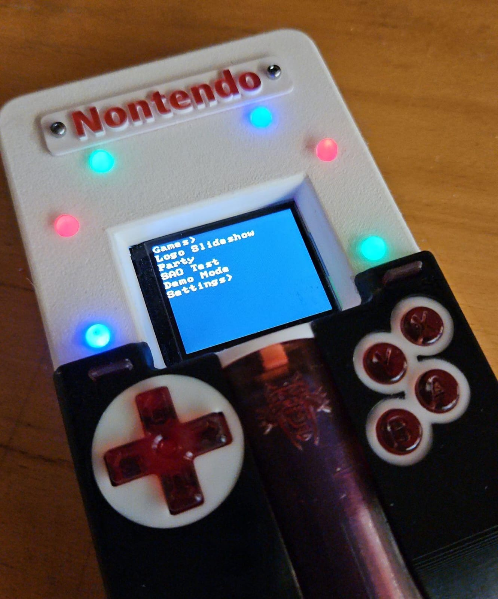
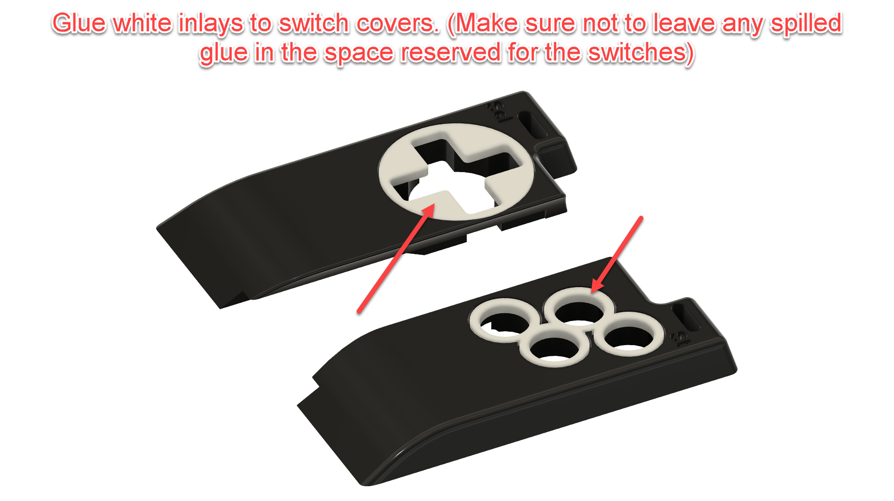
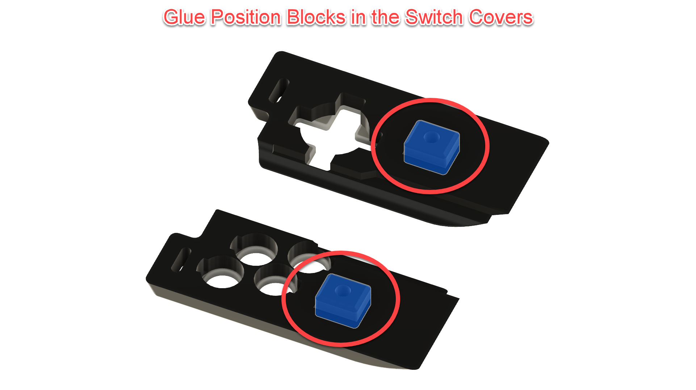
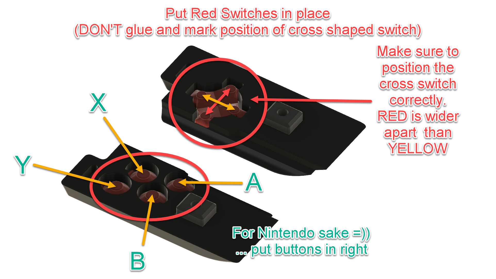
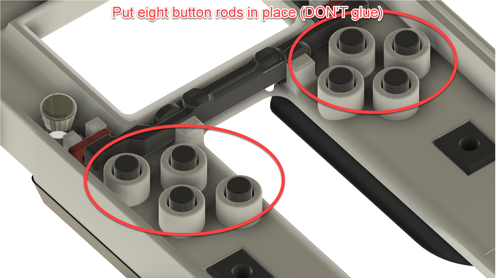
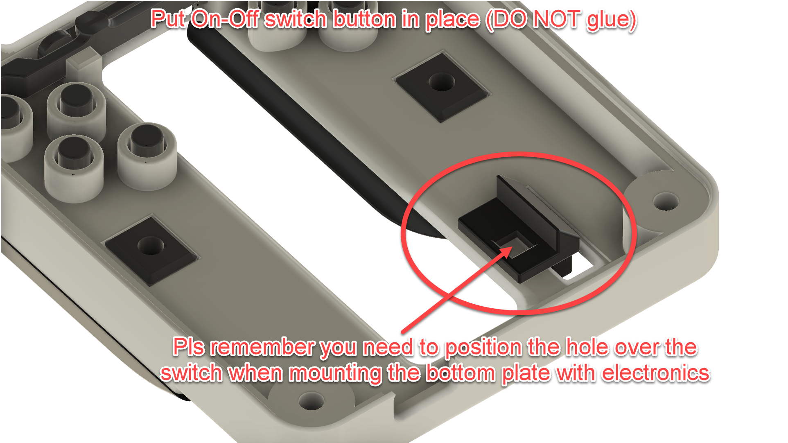
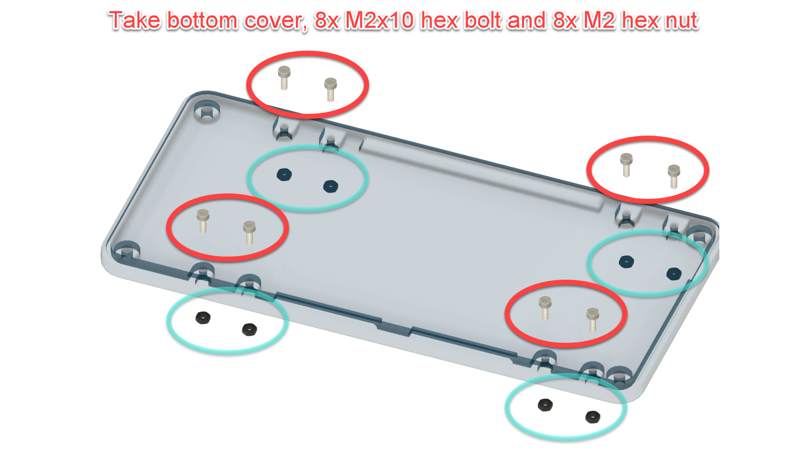
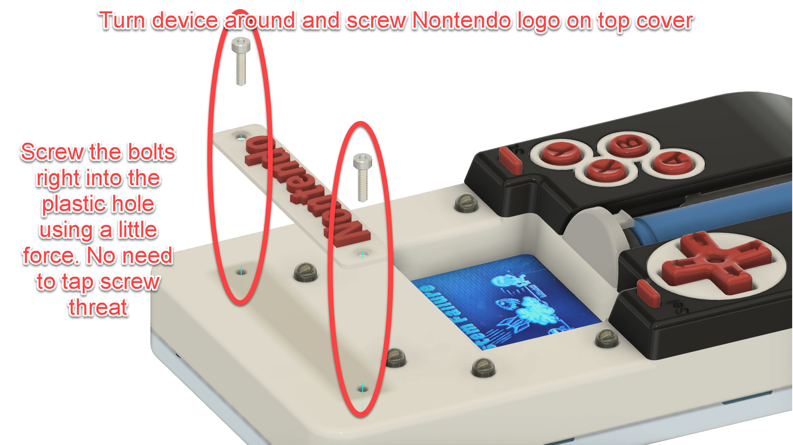

# 3D printable vintage case for the BCD-0o27

With a nod to an ancient Nintendo ;-)

| Front view | Back view | Front detail |
|:---------:|:---------:|:---------:|
|  |  |  |

Contents

[1 Materials used for printing and constructing](#materials-used-for-printing-and-constructing)

[1.1 Resins used (SLA Printer: Anycubic Photon Mono X 6K)](#resins-used-sla-printer-anycubic-photon-mono-x-6k)

[1.2 Finishing of transparent components](#finishing-of-transparent-components)

[1.3 Required mounting materials such as heat inserts, nuts and bolts.](#required-mounting-materials-such-as-heat-inserts-nuts-and-bolts.)

[2 Exploded view](#exploded-view)

[3 Building instructions](#building-instructions)

[4 Tip: Two ways of making a two colour ‘Nontendo’ logo](#tip-two-ways-of-making-a-two-colour-nontendo-logo)

[5 Nintendo style hand bracelet](#nintendo-style-hand-bracelet)

#  

# Materials used for printing and constructing

Filaments used (FDM Printer: Voron 2.4-350)

-   Top Cover: Amazon Basics PLA White (need to print in PLA because
    threaded heat inserts are used).

Used a resin printer for all other parts to get maximum print quality.

## Resins used (SLA Printer: Anycubic Photon Mono X 6K)

-   Black parts:

    -   Elegoo Water Washable Photopolymer Resin, 1/1 mixture of Black
        and Smokey Black (The mixture produces better and stronger
        results than the components alone).

-   Red parts:

    -   Elegoo Water Washable Photopolymer Resin, Red.

-   White parts (except top cover)

    -   Elegoo Water Washable Photopolymer Resin, White

-   Blue parts (only bottom cover)

    -   Elegoo Water Washable Photopolymer Resin, Red

## Finishing of transparent components

The transparent components (red and blue) are sanded, polished and
lacquered to give the appearance of being made of glass.

## Required mounting materials such as heat inserts, nuts and bolts.

-   4x – M3 heat inserts

-   4x – M3x10mm zinc plated steel Hex Drive Flat Head Screw

-   10x – M2x7mm zinc plated steel socket head screw

-   8x – M2 zinc plated steel hex nut

# Exploded view

# Building instructions

# Tip: Two ways of making a two colour ‘Nontendo’ logo

# Nintendo style hand bracelet

If you like the hand bracelet, you can order it here:

<https://www.amazon.nl/dp/B09PG46FR1?psc=1&ref=ppx_yo2ov_dt_b_product_details&language=en_GB>

There are no holes for the hand bracelet in the original design. You
will have to drill them, yourselves.

Have FUN…!!!
